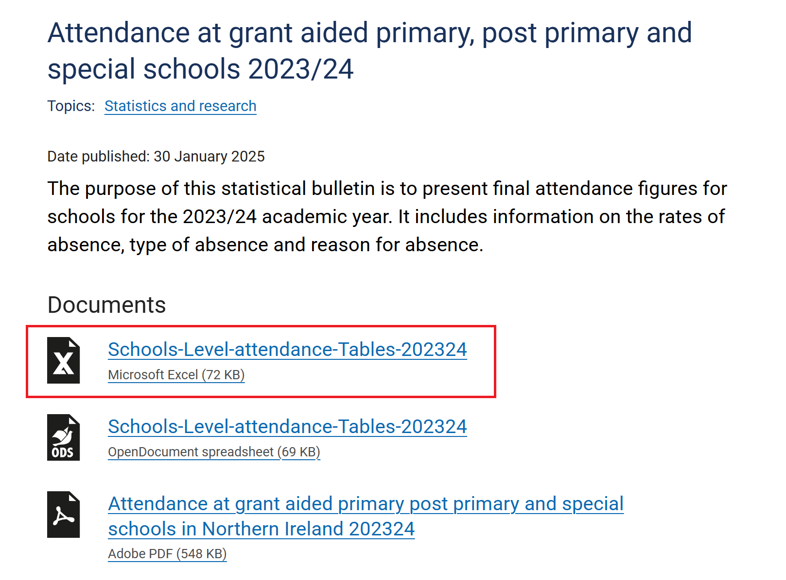

# Lab 01 - Download the data  
Manually download the data to be used in the labs.

## Steps

1.  Go to the main website for **Department for Education (Northern Ireland)**:  
https://www.education-ni.gov.uk/articles/pupil-attendance

> [!TIP]
> Hold down <kbd>Ctrl</kbd> and click the link to open in a new window.

2.  Scroll down to the **Data** section.

3.  Download the Excel versions of the following data:

- Pupil attendance 2023/24
- Pupil attendance 2022/23
- Pupil attendance 2021/22

> [!NOTE]
> The 2022/23 data is missing.  More files will be added later once the import pipeline is setup.

## Exercise 1.1
Spend some time analysing the folder and folder contents.

## Questions
- How many files have been downloaded?
- What type of files are they? (.csv, .xlsx, other?)
- Are they all in the same format with the same headers?
- Could this process be automated further?

## Next Steps
- [Lab 02 - Set up Fabric](/labs/lab02/lab02.md)
- [Home](README.md)