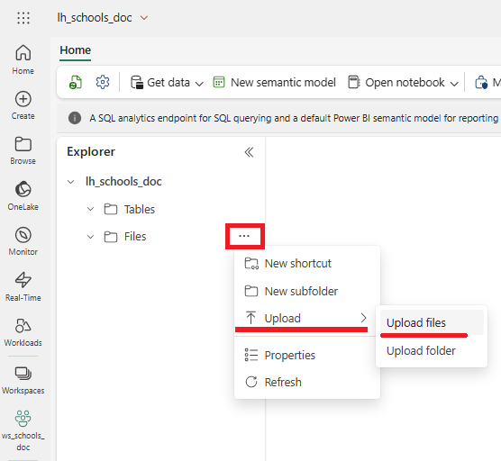
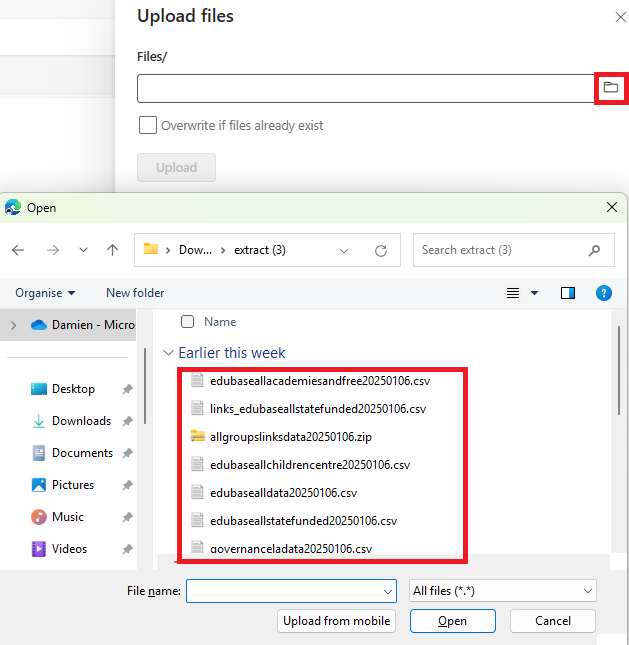
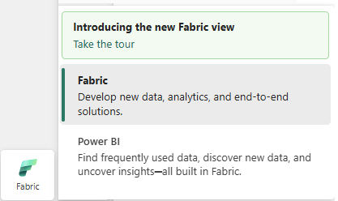
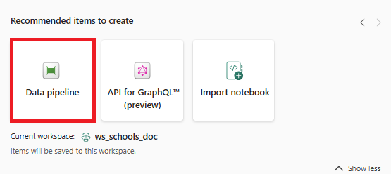
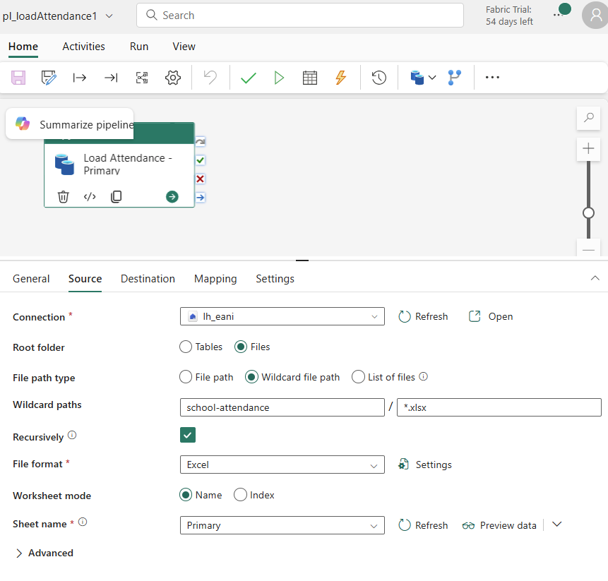
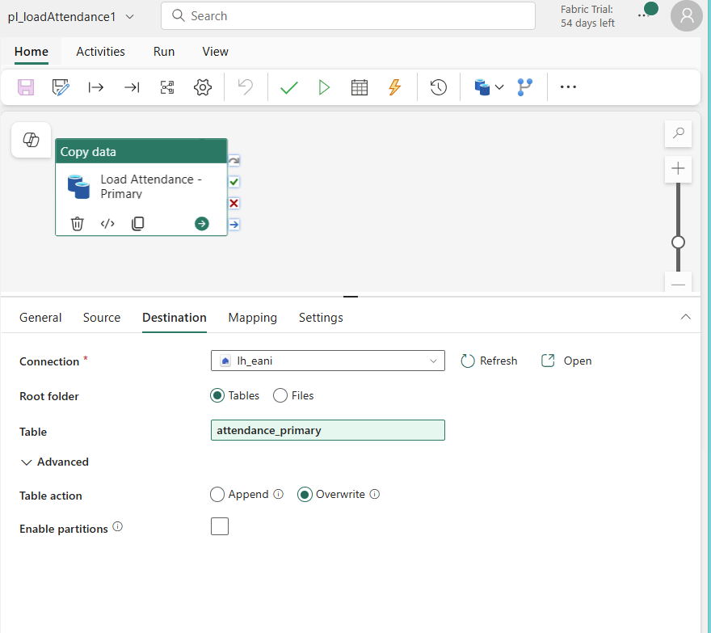
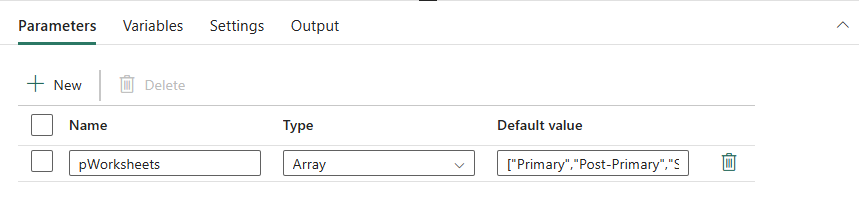
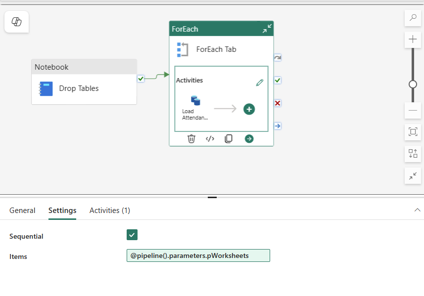
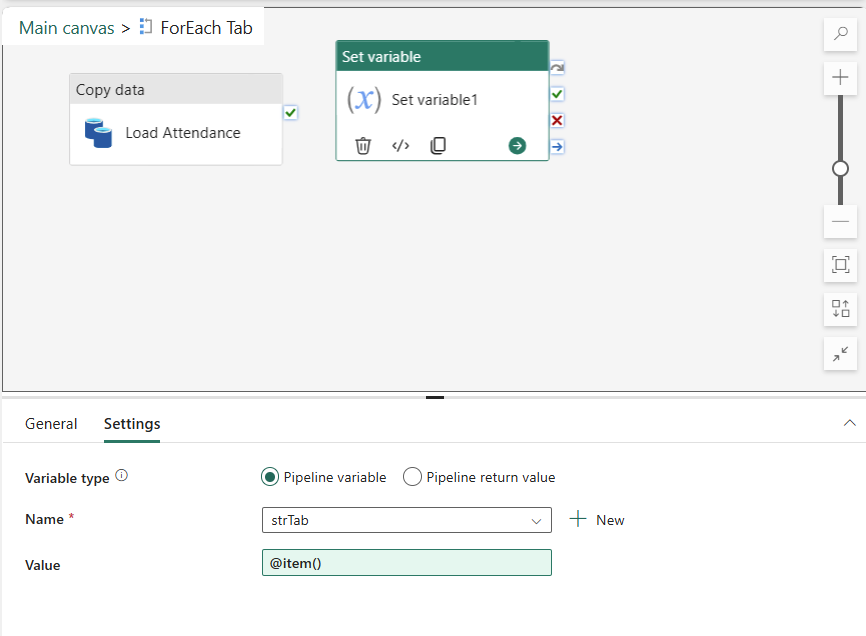

# Lab 03 - Import to Lakehouse using Data Pipeline
Import the data to a Lakehouse


## Steps

1.  Make sure you are in the Lakehouse you have just created.  Go to the **Files** section.

2. Click the three dots (ellipsis) next to **Files**, then **Upload** > **Upload Files**



3. Select the files you downloaded.  These should be in your **Downloads** folder: 



Click **Open** to upload the files, then **Upload**.

> [!TIP]
> Paste in the folder path if you have it on your clipboard.


The files should appear in the **Files** area of the Lakehouse

4.  Inspect some of the files

## Exercise 2.1
Spend some time analysing the folder and folder contents in Lakehouse Explorer.

---

## Load a single tab
We will now load the files into Tables in the Lakehouse using Data Factory

5. Select the **Fabric** option in the workload switcher:



6.  Find the **+ New Item** option in the top left-hand side, and select **Data Pipeline**:



Specify a name for the data pipeline like *pl_loadAttendance1*" and click **Create**.

7.  Add a **Copy activity**.  Configure the Source tab as follows:




8.  Configure the Sink as follows:



9. Save and run the Pipeline.

## Questions
- Discuss the lab.  How easy was it to configure?
- What's missing (eg multiple tabs).  How might we extend this?

## Load multiple tabs

10.  Create a new pipeline

Specify a name for the data pipeline like *pl_loadAttendance2*" and click **Create**.

11.  Add a parameter to the Data Pipeline

12.  Add a **Notebook** activity

- Call the parameter **pWorksheets**
- Set the Type to **Array**
- Set the value of the parameter to the following text:

```
["Primary","Post-Primary","Special"]
```

It should look similar to this:




13.  Add a **For Each** activity

- Click the **Sequential** check box to make sure it is clicked.

Discuss why we have done this.

- Set the Items option to the array using the Dynamic Input



14.  Add a **Set Variable** activity inside the For Each activity
- Create a new variable called **strTab**
- Set the value to `item()`




15.  Save and run the pipeline.
16.  Add and configure a **Copy** activity

## Questions
- Discuss the lab.  What is the difference between the single and multiple copy?

## Exercise 2.3
Write some SQL against the tables that have loaded.

## Exercise 2.4
[Instructor]  Create a notebook that can do the same process.

## Next Steps
- [Lab 04 - Import to Data Warehouse using Data Pipeline](/labs/lab04/lab04.md)
- [Home](README.md)